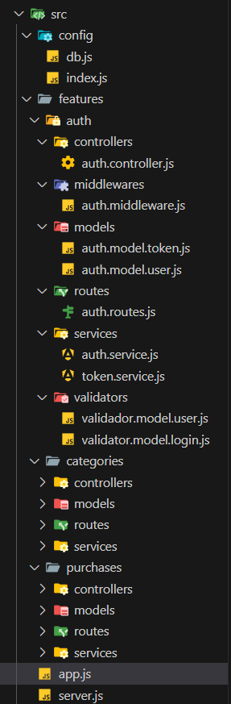

# Personal Expense Tracker API

A simple RESTful API to manage personal expenses, built with **Node.js**, **Express**, and **MongoDB**.

🎥 [Register a New User](https://www.youtube.com/watch?v=zCmjAUtM-gQ)  
🎥 [Login and Logout Demo](https://www.youtube.com/watch?v=PZUU2FXAoMM)

## Overview

This project provides a simple and efficient solution to record and manage personal expenses.  
Users can register, log in, and perform full CRUD operations on their purchases.  
It also includes security features such as **JWT authentication**, **password hashing**, and **input validation**.

## Technologies Used

- **Node.js** – JavaScript runtime environment
- **Express** – Framework for building web APIs
- **MongoDB** – NoSQL database
- **JWT** – Secure authentication and authorization
- **bcrypt** – Password hashing

## Installation

1. Clone the repository:

```bash
git clone https://github.com/CarlosZubilete/Api-Personal-Expense-Record.git
cd Api-Personal-Expense-Record

```

2. Install dependencies:

```bash
npm install
```

3. Create a .env file in the root directory and add:

```
PORT=3000
MONGODB_URI=your_mongodb_connection_string
JWT_SECRET=your_jwt_secret

```

4. Start the server:

```bash
npm start
```

## Project Structure



## Usage

Once the server is running and MongoDB is connected, you can test the following endpoints:

### Autenticación

```
| Method | Endpoint         | Description                  |
| ------ | ---------------- | ---------------------------- |
| POST   | `/auth/register` | Register a new user          |
| POST   | `/auth/login`    | Log in and get a token       |
| POST   | `/auth/logout`   | Log out and invalidate token |

```

### Purchases

```
| Method | Endpoint         | Description                       |
| ------ | ---------------- | --------------------------------- |
| POST   | `/purchases/new` | Create a new purchase             |
| GET    | `/purchases`     | Get all purchases (requires auth) |
| GET    | `/purchases/:id` | Get a specific purchase           |
| PATCH  | `/purchases/:id` | Update a purchase                 |
| DELETE | `/purchases/:id` | Delete a purchase                 |

```

## Autor

Developed by Carlos Zubilete.
[GitHub](https://github.com/CarlosZubilete).

## License

This project is licensed under the MIT License.
